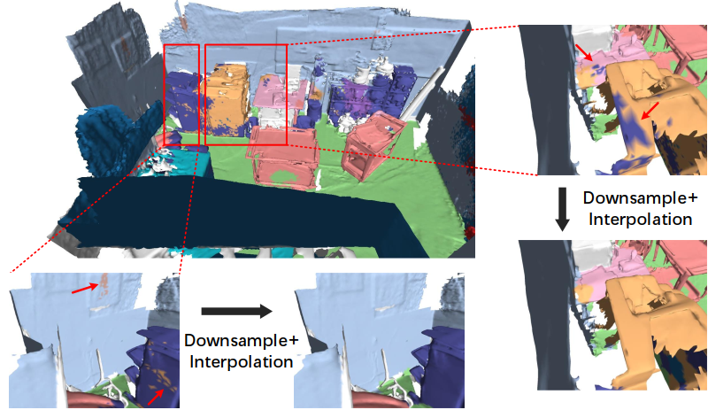

# PointRas: Uncertainty-Aware Multi-Resolution Learning for Point Cloud Segmentation


by [Yu Zheng](https://yzheng97.github.io/), [Xiuwei Xu*](https://xuxw98.github.io/), [Jie Zhou](https://www.au.tsinghua.edu.cn/info/1078/3126.htm), and [Jiwen Lu](http://ivg.au.tsinghua.edu.cn/Jiwen_Lu/).


## Introduction
This repository is built for the official implementation of:

__PointRas__: Uncertainty-Aware Multi-Resolution Learning for Point Cloud Segmentation ___(TIP2022)___ [[link](https://ieeexplore.ieee.org/document/9892683)]
<br>
If you find our work useful in your research, please consider citing:

```
@article{zheng2022pointras,
  title={PointRas: Uncertainty-aware multi-resolution learning for point cloud segmentation},
  author={Zheng, Yu and Xu, Xiuwei and Zhou, Jie and Lu, Jiwen},
  journal={IEEE Transactions on Image Processing},
  volume={31},
  pages={6002--6016},
  year={2022},
  publisher={IEEE}
}
```


## Usage

We provide scripts for different baseline methods:

* [PointConv-Ras](./PConv): PointConv incorporated with our PointRas.
 
* [ELGS-Ras](.): ELGS incorporated with our PointRas.

You can find the instructions for running these tasks in the above corresponding folders.


## Contact

You are welcome to send pull requests or share some ideas with us. Contact information: Yu Zheng (zhengyu19 AT mails.tsinghua.edu.cn).

## Acknowledgement

Many thanks for the flexible code base from [PointNet++](https://github.com/charlesq34/pointnet2), [PointConv](https://github.com/DylanWusee/pointconv) and [ELGS](https://github.com/fly519/ELGS), whose citations are: 
```
@article{qi2017pointnet++,
  title={Pointnet++: Deep hierarchical feature learning on point sets in a metric space},
  author={Qi, Charles Ruizhongtai and Yi, Li and Su, Hao and Guibas, Leonidas J},
  journal={Advances in neural information processing systems},
  volume={30},
  year={2017}
}
```
```
@inproceedings{wu2019pointconv,
  title={Pointconv: Deep convolutional networks on 3d point clouds},
  author={Wu, Wenxuan and Qi, Zhongang and Fuxin, Li},
  booktitle={Proceedings of the IEEE/CVF Conference on computer vision and pattern recognition},
  pages={9621--9630},
  year={2019}
}
```
```
@article{wang2019exploiting,
  title={Exploiting local and global structure for point cloud semantic segmentation with contextual point representations},
  author={Wang, Xu and He, Jingming and Ma, Lin},
  journal={Advances in Neural Information Processing Systems},
  volume={32},
  year={2019}
}
```
